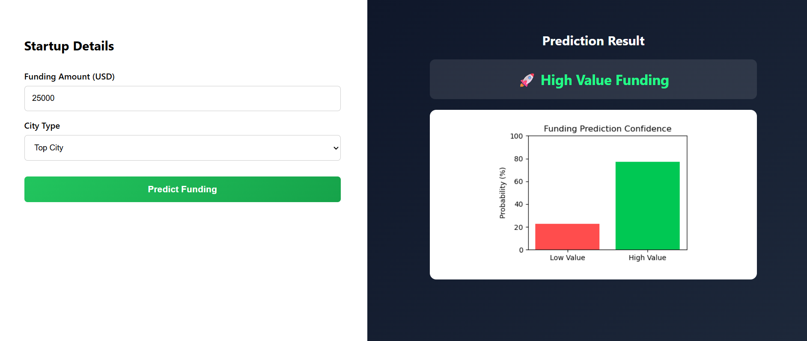

# Indian Startup Funding Analysis 📊


<!-- Online image link (GitHub renders this automatically) -->
<!-- https://github.com/darpana-chauhan/Indian-Startup-Funding-Analysis/blob/main/Indian_Startup_Funding.png -->

---

## 📌 Project Overview
This project performs an end-to-end analysis of Indian startup funding data and builds a machine learning model to predict whether a startup is likely to receive **High Value Funding**.  
The project covers **data cleaning, exploratory data analysis (EDA), feature engineering, model building, evaluation, and deployment using Flask**.

---

## 🎯 Objectives
- Analyze startup funding trends across India
- Identify top-funded industries and cities
- Understand funding distribution and outliers
- Build a predictive machine learning model
- Deploy predictions through a user-friendly web application

---

## 🗂️ Project Structure


Indian_Startup_Funding/

│
├── Analysis_file/
│ └── Indian_Startup_Funding.ipynb
│
├── CSV_file/
│ ├── startup_funding.csv
│ ├── startup_funding_cleaned.csv
│ └── startup_funding_model.pkl
│
├── static/
│ └── style.css
│
├── templates/
│ └── index.html
│
├── app.py
├── Indian_Startup_Funding.png


---

## 🛠️ Tools & Technologies
- **Programming Language:** Python  
- **Libraries:** Pandas, NumPy, Matplotlib, Seaborn, Scikit-learn  
- **IDE:** Jupyter Notebook  
- **Web Framework:** Flask  
- **Frontend:** HTML, CSS  

---

## 📊 Data Analysis Workflow
1. Problem Understanding  
2. Data Collection  
3. Data Import  
4. Data Cleaning & Missing Value Handling  
5. Exploratory Data Analysis (EDA – Basic & Advanced)  
6. Feature Engineering  
7. Data Preprocessing  
8. Model Selection  
9. Model Training  
10. Model Evaluation  
11. Hyperparameter Tuning  
12. Model Deployment using Flask  

---

## 🤖 Machine Learning Model
- **Algorithm:** Random Forest Classifier  
- **Target Variable:** High Value Funding (Binary Classification)  
- **Class Imbalance Handling:** `class_weight='balanced'`  
- **Evaluation Metrics:** Accuracy, Precision, Recall, F1-score, Confusion Matrix  

---

## 🌐 Web Application (Flask)
The Flask web app allows users to:
- Enter startup funding details
- Select whether the startup is located in a top city
- Get instant prediction results (High / Low Value Funding)
- View results in a clean, professional UI without scrolling

---

## 📈 Key Insights
- Major metro cities dominate startup funding
- Certain industries consistently attract higher investments
- Funding amounts show strong right-skewness with large outliers
- High-value funding cases are relatively fewer but impactful

---

## 🚀 How to Run the Project Locally
```bash
pip install flask pandas numpy scikit-learn matplotlib seaborn joblib
python app.py
